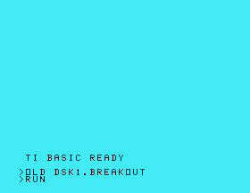

# TI Breakout

TI Breakout is a simple action game for the TI-99/4A home computer. Keep
bouncing balls in the playing field with the paddle. Aim the balls to clear
the bricks before time runs out.

## Features

* Fast and smooth.
* Straight into the action with 4 bouncing balls.
* Colorful graphics, sounds, chords, and chord progressions.
* Entirely written in TMS-9900 assembly code.
* Runs on a console without expansion cartridges, by breaking out of the
  TI BASIC sandbox.
* The source code, with useful generic definitions and macros.

## Screenshots

## Requirements

* TI-99/4A home computer.
* Floppy disk drive.

or:

* An emulator for the TI-99/4A, such as Mame.

## Building

You need to have the [xdt99](https://github.com/endlos99/xdt99)
cross-development tools installed, for the `xas99` assembler.

On Linux, you can run the build script:

    ./build.sh

Alternatively, you can run its commands manually.

You'll then have the disk image `out/breakout.dsk`.

## Running

The easiest way is to use the Mame emulator.

On Linux, you can run the script to launch Mame with the proper options:

    ./run.sh

Alternatively, you can run the Mame command manually.

Once Mame is running and showing the TI-99/4A home screen:

1. Press any key.
2. Press `1` for "TI BASIC"
3. Type `OLD DSK1.BREAKOUT` and <Enter>
4. Type `RUN` and <Enter>

The program then starts on the animated title screen with some instructions
and the high score. You can start a game by pressing the space bar. Control
the paddle with `Z` and `X` (fast/slow left), and `.` and `/` (slow/fast
right). The shrinking red bar on the left shows the remaining time. The number
on the right shows the score. When you clear a playing field, you get a time
bonus and a new, wider playing field. The available time remains the same, so
make good use of the bouncing balls to clear the field in time!

You can exit Mame by pressing `Insert` and then `Esc`.

## Jailbreak

Technically, the game is a proof of concept for breaking out of the sandbox of
an unexpanded console. Texas Instruments restricted software on the console to
its slow TI BASIC, without access to the way more powerful TMS-9900 assembly
code or even the built-in GPL bytecode. You could only develop and run
assembly code with expensive specialized cartridges and hardware expansion
systems. This limited commonly available software to simple programs or
professional cartridges. In hindsight, the artificial sandbox greatly
contributed to the demise of the computer in the eighties, in favor of more
open systems.

However, a jailbreak that was little-known at the time could have made a
difference:

* The brothers Riccardo and Corrado Tesio published the concept in 1984, in the
  Italian magazine [MC Microcomputer
  34](https://atariage.com/forums/topic/273248-ti-basic-sprite-games/?do=findComment&comment=3914996), which
  [ti99iuc](https://atariage.com/forums/profile/24673-ti99iuc/) archived and
  translated in 2017.
* [James Abbatiello](https://www.pagetable.com/?author=2) created another
  [prototype](https://atariage.com/forums/topic/162941-assembly-on-the-994a/?do=findComment&comment=2849894),
  which [Vorticon](https://atariage.com/forums/profile/25753-vorticon/)
  brought back to attention in 2013.
* [Senior_falcon](https://atariage.com/forums/profile/34177-senior_falcon/)
  elaborated on the idea with [a
  demo]}(https://atariage.com/forums/topic/218571-the-basic-sandbox-is-no-more/)
  in 2013 and [an early prototype for a
  game](https://atariage.com/forums/topic/273248-ti-basic-sprite-games/) in
  2017.

This game takes the prototypes a step further, with the help of modern
technology -- notably the brilliant [xdt99](https://github.com/endlos99/xdt99)
cross-development tools. The source code assembles to a small TI BASIC program
that escapes its sandbox. The payload consists of the actual assembly code.
Since a basic console only has 256 bytes of CPU RAM (!) and 16 KB of video
RAM, I have written the game code as small snippets that get swapped in from
video RAM to CPU RAM. The technique requires some thriftiness and creativity,
but it's pretty successful. Oh, the great things that could have been if we
had known this back in the days...

## License

TI Breakout is released under the GNU General Public License, version 2.

Enjoy!

Eric Lafortune
